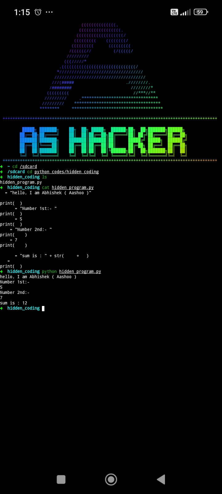
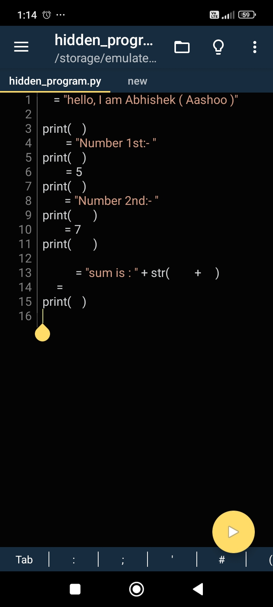
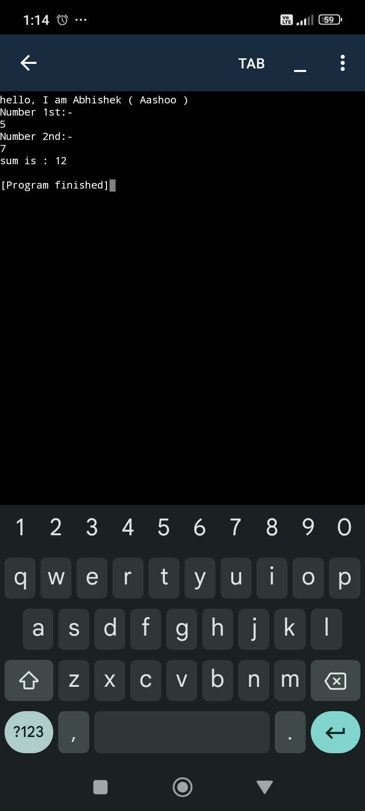

# **Hidden Program - Python Project**

## **Overview**
Welcome to the **Hidden Program** project! This innovative Python project utilizes **hidden variables**—invisible characters in variable names that remain unreadable to the human eye but are fully functional for computers. The project focuses on adding a layer of **code obfuscation** and explores the power of **ASCII-level processing**, providing enhanced security for sensitive logic.

### **Key Features**
- **Code Obfuscation**: Makes the code harder to reverse-engineer, offering better protection against unauthorized access.
- **Creative Security**: A unique approach to securing logic by using hidden variables, invisible to humans but accessible to computers.
- **Low-Level Programming**: Explores how computers interpret code at the **ASCII** level, offering insights into low-level data processing.

### **Project Demo**
Below are three screenshots showing the working of the project:

- **Running in Terminal (Termux)**  
  

- **Python IDE for Android (Pydroid IDE) Code Editor**  
  

- **Running in Python IDE (Pydroid IDE App)**  
  

*Note: The rest of the project code is private to ensure security and prevent unauthorized tampering.*

### **Future Enhancements**
- **Automated Code Obfuscator**: Develop a tool that applies hidden-character logic to any Python script for enhanced security.
- **Custom Interpreter**: Create a custom interpreter to process hidden-character-based code.
- **Steganographic Integration**: Investigate combining this concept with **steganography** for additional security.
- **Advanced Debugging Tool**: Build a tool to map hidden variables to readable names temporarily for easier debugging and maintenance.

### **Project Credits**
- **Creator**: [Aashoo Sharma](https://www.linkedin.com/in/aashoosharma)  
- **Website**: [AashooSharma.tech](https://AashooSharma.tech)  
- **GitHub Repository**: [Hidden Program](https://github.com/AashooSharma/Hidden-Programming)

### **License**
This project is private, and all rights are reserved.

---

## **GitHub Badges**

  
  
  
  

